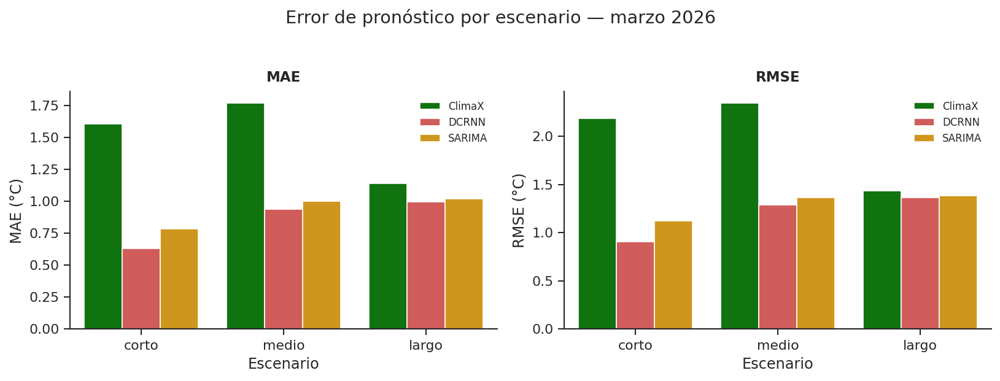
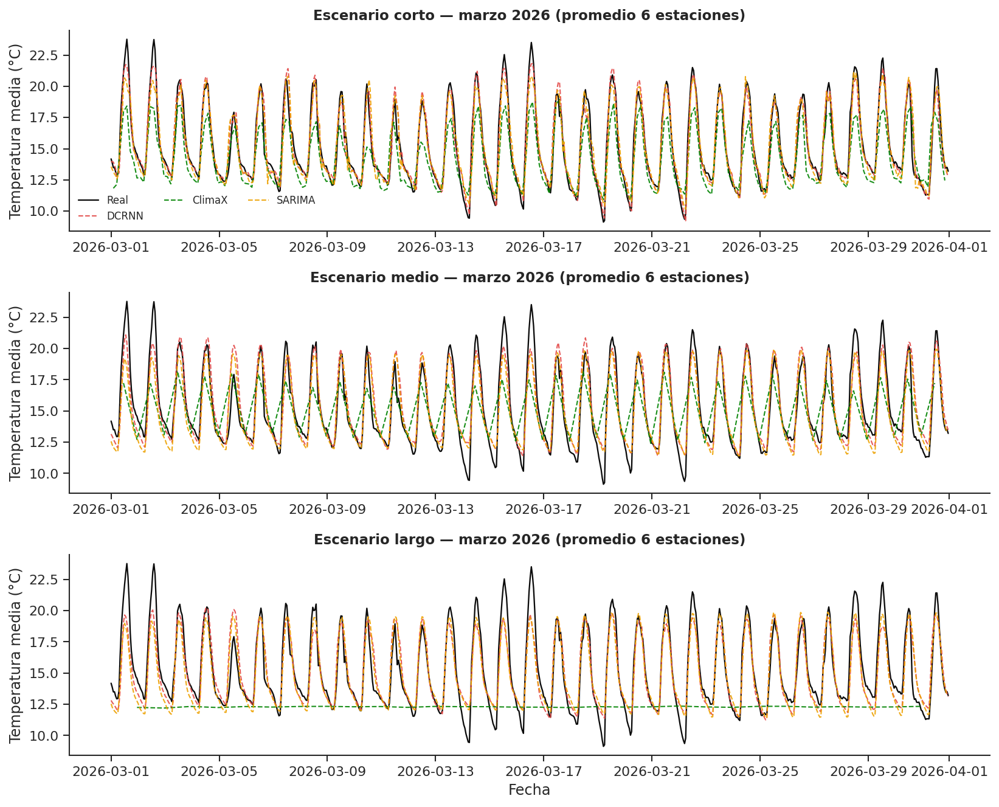
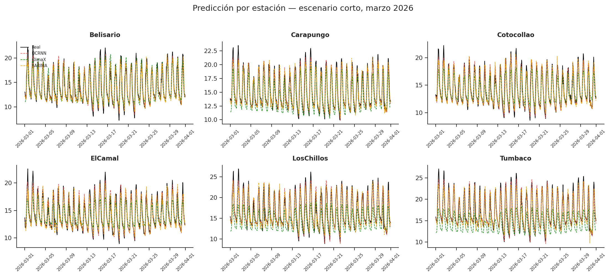
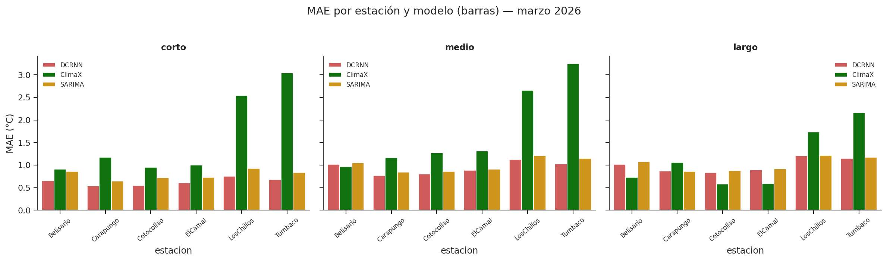
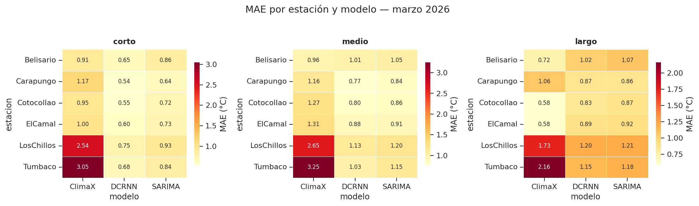

# Análisis de resultados — Comparación de modelos (DCRNN vs. ClimaX vs. SARIMA)

Redacción de la fase de análisis correspondiente a
`notebooks/analisis_comparativo_modelos.ipynb`. Compara el modelo ganador de
la familia GNN —**DCRNN**, según el test de Diebold-Mariano documentado en
`docs/metodologia_entrenamiento.md`— contra **ClimaX** fine-tuneado (modelo
fundacional de clima) y **SARIMA** (mejor variante de la familia clásica
ARIMA/SARIMAX), en los tres escenarios de horizonte (corto=3h, medio=48h,
largo=72h), sobre el conjunto de test completo (2024-01-01 a 2026-03-31) y
específicamente sobre **marzo 2026**, el mes usado como criterio de
desempate final.

## 1. Métricas globales (test completo, 2024–2026)

| Escenario | Modelo | MAE (°C) | RMSE (°C) | R² | MAPE (%) |
|---|---|---|---|---|---|
| Corto | ClimaX | 1.567 | 2.124 | 0.626 | 9.55 |
| Corto | **DCRNN** | **0.657** | **0.946** | **0.926** | **4.27** |
| Corto | SARIMA | 0.808 | 1.139 | 0.893 | 5.24 |
| Medio | ClimaX | 1.798 | 2.407 | 0.600 | 10.09 |
| Medio | **DCRNN** | **1.040** | **1.405** | **0.837** | **6.88** |
| Medio | SARIMA | 1.063 | 1.425 | 0.832 | 7.00 |
| Largo | ClimaX | 1.180 | 1.491 | **-0.295** | 8.66 |
| Largo | DCRNN | 1.094 | 1.454 | 0.826 | 7.16 |
| Largo | **SARIMA** | **1.078** | **1.444** | **0.828** | **7.10** |

DCRNN gana en corto y medio plazo en las cuatro métricas. En **largo
plazo, SARIMA tiene el mejor MAE, RMSE y R² de los tres modelos** — aunque,
como se ve en la sección 3 (test DM), la diferencia frente a DCRNN no es
estadísticamente significativa en ese horizonte. El hallazgo más notable
sigue siendo el **R² negativo de ClimaX en el escenario largo** (-0.295):
un R² negativo significa que el modelo predice peor que simplemente usar la
media de la serie como pronóstico constante — en la práctica, como se ve en
la sección 5, el modelo de ClimaX para horizonte largo colapsó a una
predicción casi plana. Esto es coherente con que ese entrenamiento se
detuvo muy temprano: según
`resultados/climax/largo_plazo/experiment_config.json`, se ejecutaron solo
**26 de 150 épocas máximas configuradas** (early stopping), frente a las 30
y 100 épocas de los escenarios corto y medio respectivamente.

## 2. Significancia estadística — test de Diebold-Mariano (SARIMA vs. DCRNN)

A diferencia de ClimaX (no se le aplicó DM en esta versión — ver
recomendaciones), a SARIMA sí se le corrió el test completo porque su
alineación por `fechaHora` permitió una cobertura del **100% del conjunto
de test de DCRNN** en los tres escenarios (`src/evaluation/test_diebold_mariano_arima.py`,
que reutiliza las funciones estadísticas del test A3T-GCN vs. DCRNN:
corrección de muestra pequeña de Harvey-Leybourne-Newbold y varianza de
largo plazo con lags hasta `h-1`).

| Escenario | MAE SARIMA | MAE DCRNN | DM | p-valor | Veredicto |
|---|---|---|---|---|---|
| Corto (h=3) | 0.807 | 0.657 | +28.25 | 3.6×10⁻¹⁷² | **DCRNN mejor** |
| Medio (h=48) | 1.064 | 1.040 | +1.64 | 0.101 | **Equivalentes** |
| Largo (h=72) | 1.079 | 1.094 | -1.06 | 0.291 | **Equivalentes** |

**Este es el hallazgo central del análisis de tres familias**: la ventaja
de DCRNN sobre un modelo estadístico clásico es real y muy significativa a
corto plazo, pero **desaparece estadísticamente a partir de las 48h**. En
"largo" plazo SARIMA incluso tiene un MAE puntual menor, pero tampoco esa
diferencia es significativa — ambos modelos son estadísticamente
indistinguibles ahí. Por estación, el patrón se sostiene: en "corto" DCRNN
gana en las 6 estaciones con p « 0.001; en "medio" y "largo" la mayoría de
estaciones caen en "equivalentes", con una sola excepción cada una
(LosChillos en medio, Carapungo en largo) que favorece a cada modelo
respectivamente sin cambiar la conclusión global.

Resultados completos: `resultados/diebold_mariano/dm_resultados_arima.json`
y `dm_resumen_arima.csv`.

## 3. Diebold-Mariano por pares — los 3 modelos, densidad de muestreo igualada

La sección 3 compara SARIMA contra DCRNN sobre el 100% de las ventanas
horarias de DCRNN. Para incluir a **ClimaX** en el mismo test hace falta
resolver antes un problema de alineación: ClimaX solo predice sobre
ventanas **sin solapamiento** (`stride = pred_len`), mucho más espaciadas
que el ventaneo hora a hora de DCRNN/SARIMA — no es la misma muestra, y el
test DM asume observaciones pareadas en los mismos instantes.

`src/evaluation/test_diebold_mariano_todos.py` iguala la densidad de
muestreo tomando la **intersección estricta de instantes** (fechaHora +
estación) donde los tres modelos tienen predicción — necesariamente al
ritmo más disperso de ClimaX — y corre el test DM de a pares (DCRNN–ClimaX,
DCRNN–SARIMA, ClimaX–SARIMA) sobre esa misma muestra igualada en los tres
casos, usando las mismas funciones estadísticas que la sección 3.

| Escenario | T (instantes) | Par | MAE A | MAE B | DM | p-valor | Veredicto |
|---|---|---|---|---|---|---|---|
| Corto | 6 559 | DCRNN–ClimaX | 0.667 | 1.567 | -71.26 | ≈0 | **DCRNN mejor** |
| Corto | 6 559 | DCRNN–SARIMA | 0.667 | 0.825 | -24.16 | 1.3×10⁻¹²³ | **DCRNN mejor** |
| Corto | 6 559 | ClimaX–SARIMA | 1.567 | 0.825 | +61.05 | ≈0 | **SARIMA mejor** |
| Medio | 1 630 | DCRNN–ClimaX | 0.947 | 1.800 | -32.11 | 1.1×10⁻¹⁷⁵ | **DCRNN mejor** |
| Medio | 1 630 | DCRNN–SARIMA | 0.947 | 0.979 | -3.19 | 0.0015 | **DCRNN mejor** |
| Medio | 1 630 | ClimaX–SARIMA | 1.800 | 0.979 | +28.91 | 1.1×10⁻¹⁴⁸ | **SARIMA mejor** |
| Largo | 811 | DCRNN–ClimaX | 0.718 | 1.181 | -5.15 | 3.2×10⁻⁷ | **DCRNN mejor** |
| Largo | 811 | DCRNN–SARIMA | 0.718 | 0.681 | +6.17 | 1.1×10⁻⁹ | **SARIMA mejor** |
| Largo | 811 | ClimaX–SARIMA | 1.181 | 0.681 | +5.47 | 6.0×10⁻⁸ | **SARIMA mejor** |

**DCRNN gana contra ClimaX en los tres escenarios**, con significancia muy
alta — esto era esperable por las métricas puntuales (sección 2), pero
ahora queda confirmado formalmente, algo que no se había hecho antes.
Contra SARIMA, DCRNN gana en corto y medio plazo (en medio, con p=0.0015 —
significativo, a diferencia del resultado "equivalentes" de la sección 3).
En largo plazo, SARIMA gana aquí con significancia alta.

## 4. Marzo 2026: el modelo ganador por escenario

| Escenario | Ganador | MAE (°C) | RMSE (°C) | R² | MAPE (%) |
|---|---|---|---|---|---|
| Corto | **DCRNN** | 0.629 | 0.903 | 0.929 | 4.06 |
| Medio | **DCRNN** | 0.936 | 1.289 | 0.855 | 6.28 |
| Largo | **DCRNN** | 0.993 | 1.361 | 0.838 | 6.48 |

Con marzo 2026 como criterio de desempate por MAE puntual, **DCRNN gana en
los tres escenarios** (SARIMA queda muy cerca en medio y largo: MAE 1.001 y
1.018 respectivamente, diferencias de décimas de grado). Esto es
consistente con el test DM de la sección 3: la ventaja de DCRNN es clara en
magnitud absoluta, pero solo se sostiene con significancia estadística en
el horizonte corto.

## 5. Predicción vs. real — marzo 2026 (general)

En "corto" los tres modelos siguen razonablemente bien el ciclo diurno:
DCRNN (rojo) se pega casi exactamente a la curva real, SARIMA (amarillo)
sigue el ciclo con un desfase/suavizado leve, y ClimaX (verde)
sistemáticamente subestima los picos de temperatura. En "largo" el patrón
cambia: SARIMA mantiene el ciclo diurno razonablemente, mientras que la
predicción de ClimaX se aplana casi por completo alrededor de los 12 °C
durante todo el mes, perdiendo prácticamente toda variación — la causa más
probable, otra vez, es el entrenamiento truncado a 26 épocas de ese
escenario.

## 6. Predicción por estación — marzo 2026 (escenario corto)

DCRNN se ajusta de cerca a la temperatura real en las seis estaciones,
SARIMA la sigue con un margen algo mayor pero conserva el ciclo diurno en
todas ellas. La brecha de ClimaX es más marcada en **Los Chillos** y
**Tumbaco**, las estaciones con mayor amplitud térmica diaria — ClimaX
consistentemente no alcanza los picos más altos ahí, mientras que tanto
DCRNN como SARIMA sí lo hacen.

## 7. Comparativa por estación — gráfico de barras (marzo 2026)

Vista de barras agrupadas, complementaria al heatmap de la sección 8: para
cada estación y escenario se lee directamente la magnitud del MAE de los
tres modelos lado a lado. Confirma el patrón agregado — DCRNN y SARIMA
prácticamente empatados en varias estaciones a partir de "medio" plazo,
ambos claramente por debajo de ClimaX en todas las estaciones y escenarios.

## 8. Mapa de error por estación

Esta es la vista más matizada del análisis. En "corto", DCRNN gana en las
seis estaciones sin excepción, con SARIMA en segundo lugar y ClimaX
consistentemente último. En "largo" el resultado se vuelve más parejo entre
DCRNN y SARIMA (diferencias de centésimas en la mayoría de estaciones), y
ambos superan holgadamente a ClimaX salvo en las estaciones de menor
amplitud térmica (Belisario, Cotocollao, El Camal), donde ClimaX "acierta
por inacción" al colapsar hacia una predicción cercana a la media. Esto no
cambia el resultado agregado, pero matiza la conclusión: **la ventaja de
los modelos DCRNN/SARIMA sobre ClimaX es más contundente cuanto mayor es la
variabilidad térmica de la estación**, no uniforme en todo el dominio
espacial.

## 9. Conclusión

Con el criterio acordado (MAE sobre marzo 2026) y los dos tests de
Diebold-Mariano (sección 3: SARIMA vs. DCRNN, densidad completa; sección
3b: los 3 modelos por pares, densidad igualada al `stride` de ClimaX), el
panorama de tres familias de modelos es:

- **Frente a ClimaX, DCRNN gana en los tres escenarios con significancia
  estadística muy alta** (p ≈ 0 a 3.2×10⁻⁷, sección 3b) — es el resultado
  más robusto de todo el análisis, confirmado formalmente y no solo por
  métricas puntuales.
- **Corto plazo (h=3)**: DCRNN gana con significancia estadística muy alta
  sobre SARIMA en ambos tests (denso: p≈3.6×10⁻¹⁷²; densidad igualada:
  p≈1.3×10⁻¹²³). Resultado inequívoco.
- **Medio plazo (h=48)**: con la muestra densa (todas las horas), DCRNN y
  SARIMA son estadísticamente **equivalentes** (p≈0.10). Con la muestra de
  densidad igualada a ClimaX (solo 2 horas del día representadas), DCRNN
  sí gana con significancia (p≈0.0015) — un resultado más frágil, ligado a
  qué horas del día se muestrean, que debe reportarse con esa salvedad.
- **Largo plazo (h=72)**: con la muestra densa, DCRNN y SARIMA son
  **equivalentes** (p≈0.29); esa es la lectura más representativa para
  este par. Con la muestra de densidad igualada a ClimaX (una sola hora
  del día, 23:00), SARIMA gana con significancia — un resultado válido
  solo para ese instante específico del ciclo diurno, no generalizable a
  todo el horizonte de 72h.
- ClimaX queda por detrás de ambos en las cuatro métricas puntuales en
  todos los escenarios, arrastrado además por su entrenamiento truncado a
  26 épocas en "largo".

**Lectura principal**: **contra ClimaX, DCRNN es superior de forma robusta
y estadísticamente sólida en los tres horizontes** — ese resultado no
depende de qué muestra se use. Contra SARIMA, la historia es más matizada:
la ventaja de DCRNN es clara y significativa en corto plazo bajo cualquier
muestreo, pero a partir de 48h la comparación más representativa (densidad
completa, todas las horas del día) encuentra que un SARIMA univariado y
sin exógenas —entrenado en una fracción del tiempo y sin necesitar un
grafo de estaciones ni GPU— predice, en términos estadísticos, igual de
bien que la red neuronal. Esto es un resultado relevante para el TFM: no
es que "el modelo más complejo siempre gane", sino que su ventaja sobre
métodos estadísticos clásicos está concentrada en el régimen de corto
plazo, mientras que su superioridad sobre un modelo fundacional genérico
(ClimaX) es consistente en todos los horizontes evaluados.

## 10. Resumen metodológico y limitaciones por familia de modelos

### A3T-GCN
**Aporta**: red neuronal de atención espacio-temporal sobre el grafo de las
6 estaciones REMMAQ (kernel gaussiano de distancias, ver
`docs/metodologia_entrenamiento.md`), combinando convoluciones de grafo con
un mecanismo de atención temporal para ponderar horas pasadas relevantes.
**Limitación principal**: perdió frente a DCRNN en el test de
Diebold-Mariano documentado en `docs/metodologia_entrenamiento.md` en los
tres escenarios — su mecanismo de atención no compensó la mayor capacidad
de DCRNN para modelar dependencias temporales largas vía puertas
recurrentes (GRU) combinadas con difusión sobre el grafo. Se descartó de
comparaciones posteriores por ese resultado, no por limitaciones de
implementación.

### DCRNN (ganador de la familia GNN)
**Aporta**: combina convolución de difusión sobre el grafo de estaciones
(captura correlación espacial vía distancias/kernel gaussiano) con una GRU
que modela la dinámica temporal — la arquitectura que mejor equilibra
señal espacial y temporal en este dataset. Gana con significancia
estadística clara en el horizonte corto (h=3).
**Limitaciones**: (a) su ventaja se diluye y deja de ser estadísticamente
significativa a partir de 48h frente a un SARIMA simple — la señal espacial
del grafo aporta menos cuanto más lejano es el horizonte, posiblemente
porque a más de 48h la autocorrelación temporal domina sobre la
correlación espacial instantánea entre estaciones; (b) requiere entrenar
un modelo por escenario de horizonte (no hace pronóstico multi-horizonte
nativo); (c) depende de un grafo de adyacencia fijo (kernel gaussiano de
distancias) que no se adapta si la red de estaciones cambia.

### ClimaX (modelo fundacional, fine-tuneado)
**Aporta**: parte de un modelo preentrenado sobre reanálisis climático
global, ajustado (fine-tuning) a los datos locales del DMQ — en teoría
aprovecha patrones climáticos generales sin depender de un grafo específico
de estaciones.
**Limitaciones**: (a) el escenario largo (h=72) se entrenó de forma
incompleta (26 de 150 épocas por early stopping), resultando en R²
negativo y una predicción que colapsa a una curva casi plana — no es
necesariamente una limitación estructural del modelo, sino de esta
ejecución de fine-tuning particular; (b) incluso en corto/medio plazo,
donde el R² es positivo, queda sistemáticamente por debajo de DCRNN y
SARIMA en las 4 métricas; (c) solo es competitivo (aunque no gane) en
estaciones de baja variabilidad térmica, donde su tendencia a "aplanar" la
predicción penaliza menos; (d) su ejecución depende de Colab/GPU externa,
a diferencia de SARIMA/DCRNN que corren en CPU local.

### ARIMA / SARIMA / ARIMAX / SARIMAX (familia estadística clásica)
**Aporta**: modelos de series de tiempo univariados (ARIMA/SARIMA) y con
variables exógenas (ARIMAX/SARIMAX), ajustados por máxima verosimilitud vía
filtro de Kalman, con pronóstico walk-forward hora a hora sobre el periodo
de validación/test — el enfoque clásico contra el que se mide el valor
agregado de los modelos GNN/fundacionales.
**Hallazgo propio, no solo limitación**: dentro de esta familia, **SARIMA
(sin exógenas) superó consistentemente a SARIMAX** en los 3 horizontes y en
ambos periodos evaluados — la estacionalidad diaria (`seasonal_order=
(1,0,1,24)`) captura casi toda la señal predecible, y las exógenas
meteorológicas (humedad, radiación, viento) añaden ruido/varianza en vez de
señal útil una vez que esa estacionalidad ya está modelada.
**Limitaciones**: (a) el ajuste de SARIMA es computacionalmente costoso
(un solo ajuste con la estacionalidad de periodo 24 tomó hasta ~13 min, y
la búsqueda de hiperparámetros incluso con una grilla reducida 2×2 tomó
hasta 160 min para las variantes SARIMAX) y con múltiples advertencias de
no convergencia (`ConvergenceWarning`) en combinaciones (p,q) difíciles —
la superficie de verosimilitud con componente estacional es más compleja
que la de un ARIMA simple; (b) los objetos de resultado de statsmodels con
esta estacionalidad son muy pesados en memoria (cientos de MB a >900MB por
modelo guardado), lo que forzó a acotar el paralelismo del pipeline de
entrenamiento para evitar errores de memoria; (c) es univariado por
estación — no comparte información entre estaciones como sí hace el grafo
de DCRNN/A3T-GCN, lo que probablemente explica por qué su ventaja relativa
crece justamente en los horizontes donde la correlación espacial aporta
menos (medio/largo plazo); (d) el pronóstico directo por horizonte
(entrenar un modelo separado por cada h) es la misma limitación estructural
que tiene DCRNN, no una ventaja relativa de ninguno de los dos frente al
otro.
