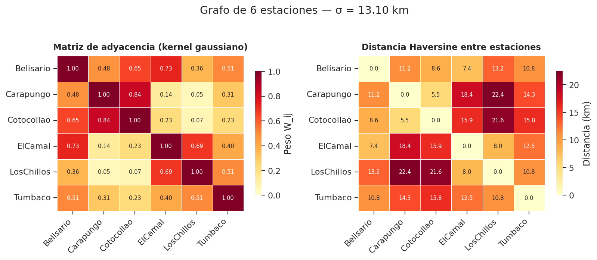
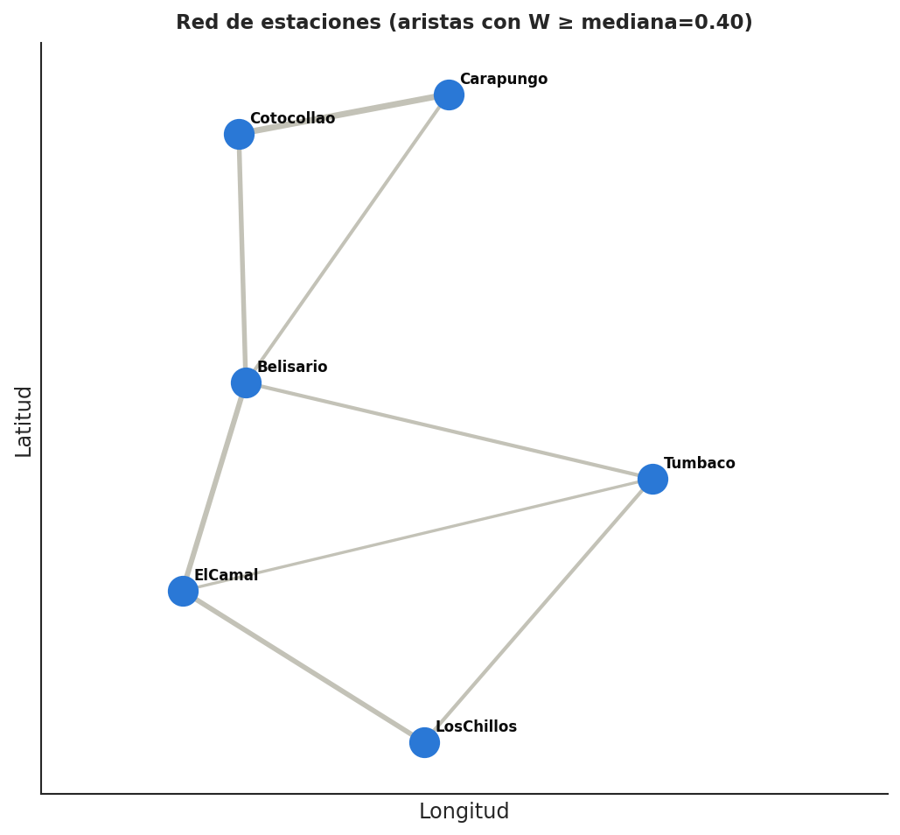
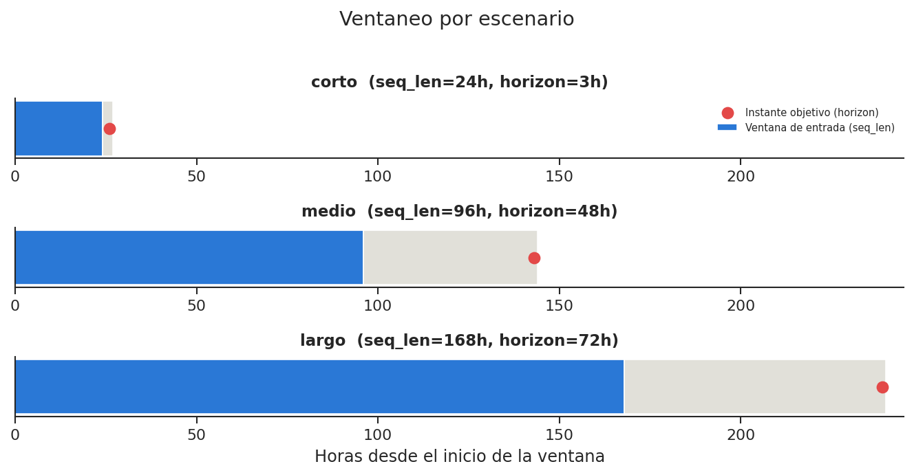
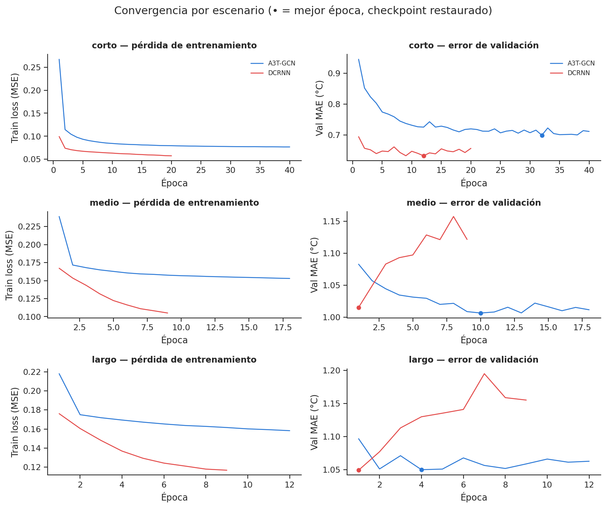
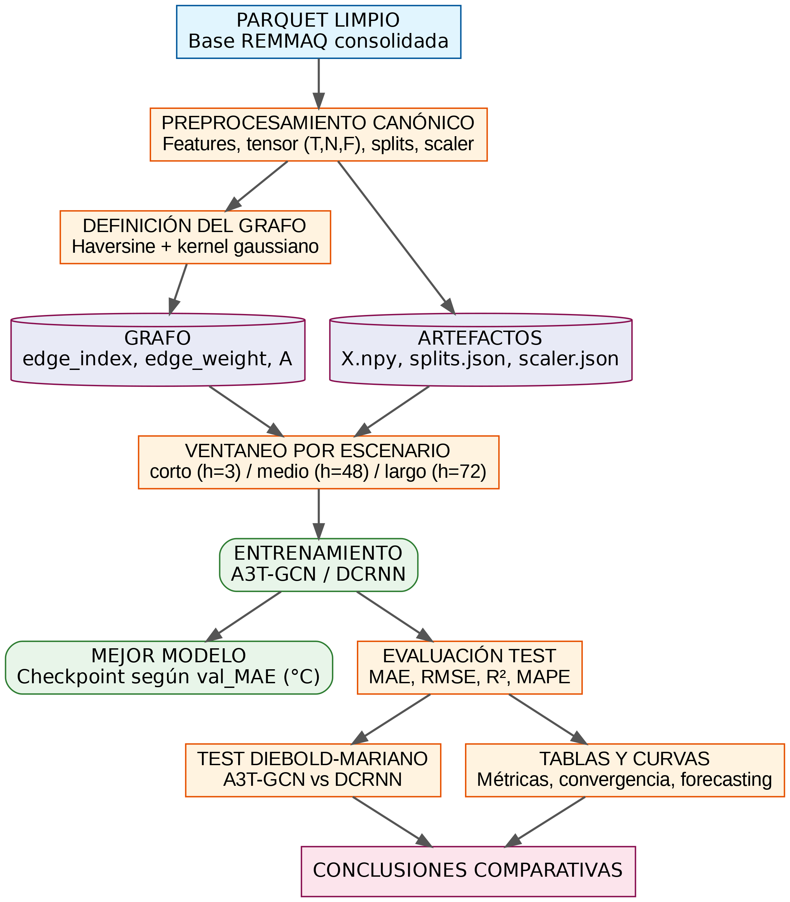

# Metodología de entrenamiento — Modelos STGNN para pronóstico de temperatura (DMQ)

Redacción de la fase de análisis metodológico correspondiente a
`notebooks/metodologia_entrenamiento.ipynb`. Todos los valores numéricos de
este documento son reales: provienen de los artefactos generados por
`src/features/preprocesamiento_canonico.py` y de los resultados ya obtenidos
por `src/models/a3tgcn/entrenar_a3tgcn.py` / `src/models/dcrnn/entrenar_dcrnn.py` — no hay cifras
de ejemplo ni placeholders.

---

## 1. Área de estudio y datos

El estudio se desarrolla sobre la red de estaciones REMMAQ del Distrito
Metropolitano de Quito (DMQ), de la cual se seleccionaron seis estaciones con
cobertura suficiente para el análisis espacio-temporal: **Belisario,
Carapungo, Cotocollao, El Camal, Los Chillos y Tumbaco**. Cada estación actúa
como un nodo de la red y aporta una serie horaria continua entre el
**2008-01-01 y el 2026-03-31**, lo que equivale a **159 960 pasos
temporales**. La variable objetivo del pronóstico es `temperaturaMedia`
(°C), y junto con las demás variables climáticas y temporales conforma un
tensor final de forma **(T=159 960, N=6, F=14)**, donde T es el número de
pasos horarios, N el número de estaciones/nodos y F el número de variables
por estación. Esta base es única y compartida por ambos modelos, lo que
garantiza que la comparación entre A3T-GCN y DCRNN se realice bajo
condiciones idénticas.

---

## 2. Preprocesamiento y construcción del dataset

### 2.1 Manifiesto de variables

El tensor conserva 14 variables por estación, organizadas en dos grupos con
un rol distinto. Las **8 variables climáticas** —encabezadas por el objetivo
`temperaturaMedia` (índice 0) y seguidas de `humedadRelativa`,
`presionBarometrica`, `radiacionSolar`, las componentes de viento
`viento_u`/`viento_v`, `precipitacion_log` y `radiacionSolar_lag1`— capturan
el estado atmosférico observado. Las **6 variables cíclicas**
(`hora_sin`/`hora_cos`, `mes_sin`/`mes_cos`, `dia_semana_sin`/`dia_semana_cos`)
codifican el tiempo calendario como coordenadas en un círculo unitario, de
forma que el modelo perciba que la hora 23 y la hora 0 están tan cerca entre
sí como la hora 0 y la hora 1 (una codificación entera lineal rompería esa
continuidad). Quedan fuera del manifiesto `hora`, `mes` y `dia_semana`
crudos (redundantes con su codificación seno/coseno), `anio` (introduciría
una tendencia absoluta que el escalador no podría extrapolar fuera del rango
de entrenamiento), la `precipitacion` sin transformar (se conserva su
versión logarítmica, más estable), `radiacionSolar_lag2` (redundante con
`radiacionSolar_lag1`) y la columna `fecha` (clave temporal, no predictora).

### 2.2 Imputación y normalización

Las 8 variables climáticas se normalizan con un `StandardScaler` **ajustado
únicamente sobre el split de entrenamiento** y luego aplicado a los tres
splits — evitar ajustar el escalador con datos de validación o test es lo
que impide la fuga de información desde el futuro hacia el pasado. Como
referencia, la variable objetivo `temperaturaMedia` tiene en entrenamiento
una media de **14.96 °C** y una desviación estándar de **3.61 °C**; estos
dos números son los que permiten des-escalar cualquier predicción del modelo
de vuelta a grados Celsius. Las 6 variables cíclicas se dejan **intactas**:
escalarlas rompería su geometría circular (el rango [-1, 1] del seno/coseno
ya es, por construcción, una normalización adecuada).

### 2.3 Partición temporal

La partición es **cronológica, sin barajar** (`shuffle=False`), para
respetar la causalidad temporal del fenómeno: el modelo nunca debe entrenar
con datos posteriores a los que luego se usan para validarlo o evaluarlo.

| Split | Periodo | Pasos (T) | Proporción |
|---|---|---|---|
| Train | 2008-01-01 → 2021-12-31 | 122 736 | 76.7 % |
| Validación | 2022-01-01 → 2023-12-31 | 17 520 | 11.0 % |
| Test | 2024-01-01 → 2026-03-31 | 19 704 | 12.3 % |

---

## 3. Definición del grafo

El grafo se define formalmente como $G = (V, E, W)$, donde:

- **$V$** es el conjunto de nodos: las 6 estaciones, en un **orden fijo y
  alfabético** (Belisario, Carapungo, Cotocollao, El Camal, Los Chillos,
  Tumbaco). Ese mismo orden indexa tanto el eje $N$ del tensor de datos como
  las filas/columnas de la matriz de adyacencia, de modo que la fila $i$ de
  $W$ y la "rebanada" $i$ del tensor $X$ siempre se refieren a la misma
  estación.
- **$E$** es el conjunto de aristas: en este grafo es **completo**
  (`threshold = 0`), es decir, existe una arista entre cada par de
  estaciones distintas — 30 aristas dirigidas ($N \times (N-1) = 6 \times 5$).
- **$W$** es la matriz de pesos/adyacencia, de tamaño $N \times N$, donde
  $W_{ij}$ cuantifica **cuán relacionadas están** las estaciones $i$ y $j$
  para efectos del modelo (no es una distancia: a mayor $W_{ij}$, mayor
  influencia esperada de una estación sobre la otra).

**¿Cómo se construye $W$ a partir de la geografía?** La hipótesis de fondo
es simple: estaciones meteorológicas cercanas tienden a compartir dinámica
térmica (la misma masa de aire, el mismo microclima de valle), mientras que
estaciones lejanas se comportan de forma más independiente. Para traducir
esa intuición en números, el proceso tiene dos pasos:

1. **Distancia Haversine ($d_{ij}$).** Es la distancia de círculo máximo
   entre dos puntos sobre la superficie de la Tierra dadas sus coordenadas
   de latitud/longitud — la distancia "real" entre dos estaciones, en
   kilómetros, considerando la curvatura terrestre (a diferencia de una
   distancia euclidiana plana, que sería incorrecta a esta escala
   geográfica). Es una matriz $N \times N$ simétrica con diagonal cero
   ($d_{ii}=0$).
2. **Kernel gaussiano (RBF).** La distancia por sí sola no es un peso útil
   (crece sin límite y su relación con la "similitud" no es directa). Se
   convierte en un peso acotado en $[0, 1]$ mediante:

$$
W_{ij} =
\begin{cases}
1 & \text{si } i = j \quad \text{(auto-similitud)} \\[4pt]
\exp\!\left(-\dfrac{d_{ij}^{\,2}}{\sigma^{2}}\right) & \text{si } i \neq j
\end{cases}
\qquad
\sigma = \frac{1}{N(N-1)}\sum_{i \neq j} d_{ij}
$$

   Aquí **$\sigma$ (sigma)** es el *ancho de banda* del kernel: la distancia
   promedio entre todos los pares de estaciones, que en esta red vale
   **13.10 km**. $\sigma$ actúa como la "escala natural" del problema —
   cuando $d_{ij} \ll \sigma$ (estaciones muy cercanas entre sí en relación
   al promedio), $W_{ij} \to 1$ (conexión fuerte); cuando $d_{ij} \gg
   \sigma$, $W_{ij} \to 0$ (conexión débil, aunque nunca exactamente cero,
   por eso el grafo queda "completo" en vez de disperso). La diagonal se
   fija manualmente en 1 por convención de auto-similitud, aunque en la
   práctica las capas de convolución de grafos (GCN) añaden sus propios
   auto-enlaces internamente, por lo que **`edge_index` se guarda sin
   self-loops** para no duplicarlos.

En la representación dispersa que consume PyTorch Geometric, el grafo no se
pasa como la matriz densa $W$ sino como dos tensores: **`edge_index`**
(forma $(2, E)$, donde cada columna `[i, j]` indica una arista dirigida de
$i$ a $j$) y **`edge_weight`** (forma $(E,)$, con el peso $W_{ij}$
correspondiente a cada columna de `edge_index`). Con $N=6$ y grafo completo,
$E = 30$.

La figura de la izquierda es la matriz $W$ ya calculada: nótese, por
ejemplo, que Cotocollao y Carapungo tienen el peso más alto (0.84) por ser
las estaciones geográficamente más próximas (5.5 km), mientras que Carapungo
y Los Chillos —los extremos norte y sur de la red— tienen de las distancias
más grandes (22.4 km) y por lo tanto uno de los pesos más bajos (0.05). La
figura de la derecha es la matriz de distancias $d_{ij}$ que alimenta el
cálculo anterior.

Este segundo diagrama ubica las 6 estaciones según sus coordenadas reales
(longitud/latitud) y dibuja únicamente las aristas cuyo peso supera la
mediana, para visualizar qué pares de estaciones concentran la mayor parte
de la señal espacial que el modelo puede aprovechar.

---

## 4. Formulación del problema de pronóstico

El problema se formula como un pronóstico **directo** (un modelo
independiente por horizonte, en vez de un único modelo que pronostica paso a
paso de forma recursiva). Dado un índice temporal $i$, la ventana de entrada
es $X_{i:i+L}$ con forma $(L, N, F)$ —los últimos $L$ pasos observados en
las 6 estaciones— y el objetivo es el valor escalar
$X_{i+L+h-1,\,:,\,\text{idx\_target}}$, con forma $(N,)$: la temperatura de
cada estación exactamente $h$ horas después del último paso observado. La
ventana de entrada $L$ (`seq_len`) se elige en función de la escala temporal
que cada horizonte $h$ necesita capturar:

| Escenario | Horizonte ($h$) | Ventana de entrada ($L$) | Justificación |
|---|---|---|---|
| Corto | 3 h | 24 h (1 día) | Ciclo diurno completo |
| Medio | 48 h | 96 h (4 días) | Persistencia multi-día |
| Largo | 72 h | 168 h (7 días) | Variación sinóptica y patrón semanal |

Esta elección no es arbitraria: el análisis exploratorio de
`temperaturaMedia` (`notebooks/eda_mdt.ipynb`, sección de autocorrelación)
muestra una función de autocorrelación (ACF) significativa (p<0.05) hasta al
menos 10 días de rezago, y una autocorrelación parcial (PACF) significativa
en los rezagos 1–8 y nuevamente en 13–14 días — es decir, buena parte de la
dependencia temporal directa se concentra en la última semana, lo que
respalda usar ventanas de entrada de hasta 168 h (7 días) para el escenario
"largo" en vez de ventanas mucho más extensas. *(Nota: ese análisis de
autocorrelación se calculó sobre la base exploratoria de 11 estaciones,
2004–2026; se reporta aquí como evidencia orientativa del comportamiento de
la serie, no como un cálculo repetido sobre el tensor canónico de 6
estaciones.)*

Las ventanas se construyen **dentro de cada split** —nunca cruzan la
frontera entre train, validación y test—, lo que produce el siguiente número
de ventanas válidas por escenario:

| Escenario | Train | Validación | Test |
|---|---|---|---|
| Corto | 122 710 | 17 494 | 19 678 |
| Medio | 122 593 | 17 377 | 19 561 |
| Largo | 122 497 | 17 281 | 19 465 |

El diagrama ilustra, para cada escenario, el tamaño relativo de la ventana
de entrada (barra azul) frente al salto hasta el instante objetivo (punto
rojo): en "corto" el objetivo está apenas 3 h después del final de la
ventana; en "largo", la ventana completa (168 h) y el salto (72 h) suman 10
días de contexto temporal por muestra.

---

## 5. Arquitecturas de los modelos

Ambos modelos comparten la misma cabeza de salida (ReLU + capa lineal que
proyecta el estado oculto al valor objetivo) y difieren en cómo combinan la
componente espacial (el grafo) con la componente temporal (la secuencia de
`seq_len` pasos).

**A3T-GCN** recibe la ventana completa de una sola vez, con forma $(N, F,
L)$, y aplica una capa de convolución de grafos (GCN) combinada con una GRU
y un mecanismo de **atención temporal** que pondera cuáles de los $L$ pasos
observados son más relevantes para el pronóstico — no todos los pasos
pasados aportan lo mismo. **DCRNN**, en cambio, procesa la secuencia **paso
a paso**: en cada uno de los $L$ pasos aplica una convolución por difusión
(un paseo aleatorio de orden $K=2$ sobre el grafo) y arrastra un estado
oculto $H$ que se actualiza recurrentemente; el pronóstico se produce a
partir del estado $H$ final, funcionando como un codificador secuencial que
acumula "inercia térmica".

| Aspecto | A3T-GCN | DCRNN |
|---|---|---|
| Componente espacial | GCN sobre la topología del grafo | Convolución por difusión (random-walk), orden K=2 |
| Componente temporal | GRU + atención sobre los `periods` | GRU recurrente (procesa paso a paso) |
| Entrada por muestra | $(N, F, \text{seq\_len})$, una sola llamada | $(N, F)$ por paso, se recorren `seq_len` pasos |
| Estado propagado | Atención pondera todos los pasos | Estado oculto $H$ arrastrado en la secuencia |
| Canales ocultos | 64 | 64 |

El número de parámetros entrenables se calculó instanciando ambas
arquitecturas con el grafo real (no son cifras de catálogo): **A3T-GCN**
varía levemente entre escenarios porque su módulo de atención depende de
`periods` (=`seq_len`) — 27 737 parámetros en "corto", 27 809 en "medio" y
27 881 en "largo" — mientras que **DCRNN** es constante en **60 161**
parámetros, al no depender de la longitud de la ventana. Pese a tener más
del doble de parámetros, DCRNN tarda más por época que A3T-GCN porque su
cómputo es inherentemente secuencial ($L$ llamadas recurrentes por muestra
frente a una sola llamada con atención); ese contraste tiempo-vs-parámetros
se documenta en la sección 7.

---

## 6. Configuración experimental y entrenamiento

Ambos modelos se entrenan con **la misma configuración**, para que ninguna
diferencia de resultados pueda atribuirse a un protocolo distinto:

| Parámetro | Valor |
|---|---|
| Función de pérdida | MSE (en espacio escalado) |
| Optimizador | Adam |
| Learning rate | 1e-3 |
| Weight decay | 1e-5 |
| Recorte de gradiente | norma máx. 1.0 |
| Épocas máximas | 60 |
| Early stopping | paciencia 8 (sobre MAE de validación en °C) |
| Canales ocultos | 64 |
| K (DCRNN) | 2 |
| Semilla | 42 |

### 6.1 Batching a nivel de grafo

Para acelerar el entrenamiento, cada lote de $B$ ventanas no se procesa como
$B$ grafos separados sino como **un único grafo disjunto**: los índices de
nodo del elemento $k$ del lote se desplazan $+k \cdot N$ y las aristas se
replican con ese mismo desplazamiento, de forma que una sola llamada al
modelo resuelve el lote completo. Con el grafo real ($N=6$, $E=30$) y un
lote de demostración $B=3$, el grafo estático de `edge_index` con forma
$(2, 30)$ se convierte en un grafo por lote de forma $(2, 90)$ — 30 aristas
por cada uno de los 3 elementos del lote, sin que se mezclen entre sí.

### 6.2 Curvas de convergencia

Las curvas de convergencia mostradas a continuación son las **reales**,
generadas por el entrenamiento ya ejecutado (no una simulación): para cada
escenario se registró la pérdida de entrenamiento (MSE, espacio escalado) y
el MAE de validación (en °C) en cada época, y se restauró el mejor
checkpoint según el MAE de validación al aplicar *early stopping*.

El patrón es consistente en los tres escenarios: **DCRNN** alcanza una
pérdida de entrenamiento más baja y, en el escenario "corto", también un
mejor MAE de validación, pero **tarda más por época** que A3T-GCN — 160.7 s
frente a 117.7 s en "corto", y la brecha crece con el escenario (4056.6 s
frente a 2587.2 s en "largo", por época), justamente por el costo de recorrer
la secuencia paso a paso en vez de procesarla de una sola vez con atención.
En compensación, DCRNN converge en menos épocas: el *early stopping* lo
detiene entre 9 y 20 épocas según el escenario, frente a 12–40 épocas de
A3T-GCN, ninguno de los dos llega a agotar el máximo de 60 configurado.

---

## 7. Métricas de evaluación

Todas las métricas se calculan sobre valores **desescalados a °C**, a nivel
global y por estación:

| Métrica | Fórmula | Nota |
|---|---|---|
| MAE | $\frac{1}{n}\sum\lvert\hat{y}-y\rvert$ | Error medio en °C |
| RMSE | $\sqrt{\frac{1}{n}\sum(\hat{y}-y)^2}$ | Penaliza errores grandes |
| R² | $1-\frac{\sum(\hat{y}-y)^2}{\sum(y-\bar{y})^2}$ | Varianza explicada |
| MAPE | $\frac{100}{n}\sum\frac{\lvert\hat{y}-y\rvert}{\max(\lvert y\rvert,\varepsilon)}$ | $\varepsilon=10^{-2}$; cauteloso cerca de 0 °C |

Sobre el conjunto de test, ambos modelos degradan de forma esperable a
medida que crece el horizonte: A3T-GCN pasa de MAE=0.72 °C (corto) a
MAE=1.11 °C (largo), y DCRNN de 0.66 °C a 1.09 °C. DCRNN es sistemáticamente
igual o mejor que A3T-GCN en las tres métricas de error (MAE, RMSE, MAPE) en
los tres escenarios, aunque la brecha se estrecha notablemente en horizontes
más largos.

---

## 8. Protocolo de comparación y significancia estadística

La comparación entre modelos usa una **base idéntica** en todo el pipeline
(mismo preprocesador canónico, mismo ventaneo, mismas métricas), de forma
que cualquier diferencia observada se pueda atribuir a la arquitectura y no
al protocolo. La significancia de esa diferencia se contrasta con el **test
de Diebold-Mariano** sobre las predicciones de test:

| Escenario | h | MAE A3T-GCN | MAE DCRNN | Estadístico DM | p-valor | Veredicto |
|---|---|---|---|---|---|---|
| Corto | 3 | 0.7233 | 0.6573 | 20.37 | 2.8×10⁻⁹¹ | **DCRNN mejor** |
| Medio | 48 | 1.0484 | 1.0401 | 1.03 | 0.304 | Equivalentes |
| Largo | 72 | 1.1085 | 1.0940 | 1.40 | 0.161 | Equivalentes |

La superioridad de DCRNN solo es **estadísticamente significativa** en el
escenario corto; en los escenarios medio y largo la diferencia observada en
las métricas puntuales no es suficiente para rechazar la hipótesis de que
ambos modelos son equivalentes en desempeño.

---

## 9. Entorno de cómputo y reproducibilidad

| Componente | Versión / detalle |
|---|---|
| SO | Linux |
| Python | 3.10.12 |
| PyTorch | 2.1.2+cu121 |
| torch-geometric-temporal | 0.54.0 |
| GPU | NVIDIA GeForce RTX 4050 Laptop GPU |
| Semilla | 42 |
| Artefactos versionados | `X.npy`, `edge_index.npy`, `edge_weight.npy`, `splits.json`, `scaler.json` |

---

## 10. Diagrama de flujo del pipeline completo

El diagrama resume el recorrido íntegro descrito en las secciones
anteriores: el parquet limpio alimenta el preprocesamiento canónico, que se
ramifica en dos productos paralelos —los artefactos del tensor (`X`,
`splits`, `scaler`) y la definición del grafo (`edge_index`, `edge_weight`,
`A`)— que vuelven a converger en el ventaneo por escenario. De ahí se
entrenan ambos modelos, se restaura el mejor checkpoint según validación, se
evalúa sobre test y esa evaluación alimenta tanto el test de
Diebold-Mariano como las tablas y curvas que documentan los resultados.
